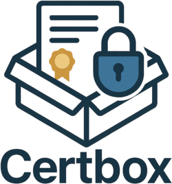

# Certbox



Certbox is a lightweight REST API for managing client X.509 certificates using a custom CA. It supports issuing and revoking certificates, exporting .pfx files for browser use, and generating a CRL for mTLS setups with Nginx. Designed for simple, internal certificate workflows.

## Table of Contents

- [Features](#features)
- [Installation](#installation)
  - [Method 1: Docker (Recommended)](#method-1-docker-recommended)
  - [Method 2: Local Python Installation](#method-2-local-python-installation)
  - [Method 2: Local Python (Legacy)](#method-2-local-python-legacy)
- [CLI Usage](#cli-usage)
  - [Available Commands](#available-commands)
  - [CLI vs API Comparison](#cli-vs-api-comparison)
  - [Environment Configuration for CLI](#environment-configuration-for-cli)
- [Directory Structure](#directory-structure)
- [API Endpoints](#api-endpoints)
- [Usage Examples](#usage-examples)
  - [API Examples](#api-examples)
  - [CLI Examples](#cli-examples)
- [Nginx mTLS Configuration](#nginx-mtls-configuration)
- [Testing](#testing)
- [Configuration](#configuration)
- [Security Notes](#security-notes)
- [License](#license)

## Features

- **Certificate Authority Management**: Automatically creates and manages a local CA
- **Client Certificate Issuance**: Create X.509 client certificates for users
- **Certificate Revocation**: Revoke certificates and update CRL
- **PFX Export**: Export certificates as .pfx files for browser installation
- **Certificate Revocation List (CRL)**: Generate CRL for Nginx mTLS setups
- **Structured Storage**: Organized directory structure for certificates and keys

## Installation

Certbox can be used both as a **REST API service** and as a **command-line tool**. Choose the installation method that best fits your use case.

### Method 1: Docker (Recommended)

1. Clone the repository:
```bash
git clone https://github.com/gisce/certbox.git
cd certbox
```

2. Build and run with Docker:
```bash
# Build the Docker image
docker build -t certbox .

# Run the service
docker run -p 8000:8000 \
  -v certbox_ca:/app/ca \
  -v certbox_crts:/app/crts \
  -v certbox_private:/app/private \
  -v certbox_clients:/app/clients \
  certbox
```

3. Or use Docker Compose:
```bash
docker compose up -d
```

The service will be available at `http://localhost:8000`.

### Method 2: Local Python Installation

#### Option A: Install from source
```bash
# Clone the repository
git clone https://github.com/gisce/certbox.git
cd certbox

# Install the package
pip install -e .
```

#### Option B: Install from PyPI (coming soon)

*PyPI installation is not yet available. The package will be published to PyPI soon. Please check back for updates or use Option A to install from source in the meantime.*
Once installed, you can use Certbox in multiple ways:

#### As a CLI tool:
```bash
# Check version and available commands
certbox --help

# Create a certificate
certbox create alice

# Start the API server
certbox api --host 0.0.0.0 --port 8000
```

#### As a Python module:
```bash
# Run the API server
python -m certbox api

# Use CLI commands
python -m certbox create alice
```

#### As a traditional Python script:
```bash
# Install dependencies first
pip install -r requirements.txt

# Run the API server
python main.py
```

## CLI Usage

Certbox provides a comprehensive command-line interface for certificate management operations. The CLI offers the same functionality as the REST API but can be used directly from the command line.

### Installation for CLI Usage

To use the CLI, install Certbox using one of the methods above. The `certbox` command will be available system-wide after installation.

### Available Commands

#### Help and Version
```bash
# Show help and available commands
certbox --help

# Show version
certbox --version
```

#### Certificate Management

**Create a client certificate:**
```bash
certbox create <username>
```

Example:
```bash
certbox create alice
```

Output:
```
✓ Certificate created successfully for user: alice
  Serial number: 12345678901234567890
  Valid from: 2023-10-03T08:12:29
  Valid until: 2024-10-03T08:12:29
  Certificate: /path/to/crts/alice.crt
  Private key: /path/to/private/alice.key
  PFX file: /path/to/clients/alice.pfx
```

**Revoke a client certificate:**
```bash
certbox revoke <username>
```

Example:
```bash
certbox revoke alice
```

Output:
```
✓ Certificate revoked successfully for user: alice
  Serial number: 12345678901234567890
  Revoked at: 2023-10-03T08:15:00.123456
  Status: revoked
```

#### Certificate Revocation List (CRL)

**Get the current CRL:**
```bash
certbox crl
```

You can redirect the output to save the CRL to a file:
```bash
certbox crl > crl.pem
```

#### Configuration

**View current configuration:**
```bash
certbox config
```

Output:
```
Current Certbox Configuration:
  Certificate validity: 365 days
  CA validity: 3650 days
  Key size: 2048 bits
  Country: ES
  State/Province: Catalonia
  Locality: Girona
  Organization: GISCE-TI
  CA Common Name: GISCE-TI CA
```

#### API Server

**Start the API server:**
```bash
certbox api [OPTIONS]
```

Options:
- `--host TEXT`: Host to bind the API server to (default: 0.0.0.0)
- `--port INTEGER`: Port to bind the API server to (default: 8000)

Examples:
```bash
# Start with default settings (0.0.0.0:8000)
certbox api

# Start on specific host and port
certbox api --host localhost --port 9000

# Start on all interfaces, port 8080
certbox api --host 0.0.0.0 --port 8080
```

### CLI vs API Comparison

| Operation | CLI Command | API Endpoint |
|-----------|-------------|--------------|
| Create certificate | `certbox create alice` | `POST /certs/alice` |
| Revoke certificate | `certbox revoke alice` | `POST /revoke/alice` |
| Get CRL | `certbox crl` | `GET /crl.pem` |
| View config | `certbox config` | `GET /config` |
| Start server | `certbox api` | N/A |

### Environment Configuration for CLI

The CLI respects the same environment variables as the API server. You can configure Certbox behavior using:

```bash
# Set custom configuration for CLI operations
export CERTBOX_ORGANIZATION="My Company"
export CERTBOX_LOCALITY="Barcelona"
export CERTBOX_CERT_VALIDITY_DAYS=730

# Then use CLI commands
certbox create alice
certbox config  # Will show your custom settings
```

Or use a `.env` file in your working directory:
```bash
# Create .env file
echo "CERTBOX_ORGANIZATION=My Company" > .env
echo "CERTBOX_CERT_VALIDITY_DAYS=730" >> .env

# CLI commands will use these settings
certbox create alice
```

### Method 2: Local Python (Legacy)

1. Clone the repository:
```bash
git clone https://github.com/gisce/certbox.git
cd certbox
```

2. Install dependencies:
```bash
pip install -r requirements.txt
```

3. Run the service:
```bash
python main.py
```

The service will start on `http://localhost:8000` and automatically create a CA if one doesn't exist.

**Note:** This method only provides the API server. For CLI functionality, use Method 2 installation options above.

## Directory Structure

The service creates and manages the following directory structure:

```
certbox/
├── ca/                 # Certificate Authority files
│   ├── ca.crt         # CA certificate
│   ├── ca.key         # CA private key
│   ├── crl.pem        # Certificate Revocation List
│   └── revoked_serials.txt # List of revoked certificate serials
├── crts/              # Client certificates
├── private/           # Client private keys
├── clients/           # PFX files for browser installation
└── requests/          # Certificate signing requests (future use)
```

### Docker Volumes

When using Docker, these directories are mounted as persistent volumes:

- `certbox_ca` - Contains the CA certificate, key and CRL
- `certbox_crts` - Contains client certificates  
- `certbox_private` - Contains client private keys
- `certbox_clients` - Contains PFX files for browser installation
- `certbox_requests` - Contains certificate signing requests

These volumes ensure data persistence across container restarts.

## API Endpoints

### Root Endpoint
- **GET /** - Service information and available endpoints

### Certificate Management
- **POST /certs/{username}** - Create a new client certificate
- **POST /revoke/{username}** - Revoke a client certificate
- **GET /certs/{username}/pfx** - Download PFX file for browser installation

### Certificate Revocation List
- **GET /crl.pem** - Download the current CRL in PEM format

### Configuration
- **GET /config** - View current configuration settings

## Usage Examples

Certbox provides both **REST API** and **CLI** interfaces. Choose the method that works best for your workflow.

### API Examples

#### Create a certificate
```bash
curl -X POST http://localhost:8000/certs/alice
```

Response:
```json
{
    "username": "alice",
    "serial_number": "12345678901234567890",
    "valid_from": "2023-10-03T08:12:29",
    "valid_until": "2024-10-03T08:12:29",
    "certificate_path": "/path/to/crts/alice.crt",
    "private_key_path": "/path/to/private/alice.key",
    "pfx_path": "/path/to/clients/alice.pfx"
}
```

#### Download PFX file for browser installation
```bash
curl -O -J http://localhost:8000/certs/alice/pfx
```

#### Revoke a certificate
```bash
curl -X POST http://localhost:8000/revoke/alice
```

Response:
```json
{
    "username": "alice",
    "serial_number": "12345678901234567890",
    "revoked_at": "2023-10-03T08:15:00.123456",
    "status": "revoked"
}
```

#### Download CRL for Nginx configuration
```bash
curl -O http://localhost:8000/crl.pem
```

### CLI Examples

The CLI provides the same functionality with a more direct interface:

#### Create a certificate
```bash
certbox create alice
```

#### Revoke a certificate
```bash
certbox revoke alice
```

#### Get CRL (output to stdout)
```bash
certbox crl

# Save to file
certbox crl > crl.pem
```

#### View configuration
```bash
certbox config
```

#### Start API server
```bash
certbox api --host 0.0.0.0 --port 8000
```

## Nginx mTLS Configuration

To use the generated certificates and CRL with Nginx for mutual TLS authentication:

```nginx
server {
    listen 443 ssl;
    server_name example.com;
    
    # Server certificate
    ssl_certificate /path/to/server.crt;
    ssl_certificate_key /path/to/server.key;
    
    # Client certificate verification
    ssl_client_certificate /path/to/certbox/ca/ca.crt;
    ssl_verify_client on;
    ssl_crl /path/to/certbox/ca/crl.pem;
    
    location / {
        # Your application
        proxy_pass http://backend;
        
        # Pass client certificate info to backend
        proxy_set_header X-Client-DN $ssl_client_s_dn;
        proxy_set_header X-Client-Verify $ssl_client_verify;
    }
}
```

## Testing

Run the included test suite with pytest:

```bash
# Install testing dependencies
pip install -r requirements-dev.txt

# Run API tests
pytest test_api.py -v

# Run CLI tests
pytest test_cli.py -v

# Run all tests
pytest -v

# Or run with the original method (deprecated)
python test_api.py
```

The test suite includes:
- **API endpoint testing** - REST API functionality and responses
- **CLI command testing** - Command-line interface functionality
- **Configuration validation** - Environment and .env file configuration
- **Certificate manager functionality** - Core certificate operations
- **Python version compatibility checks** - Support for Python 3.8+
- **Integration tests with mocked dependencies** - Isolated testing without external dependencies

Tests are also run automatically via GitHub Actions on Python 3.8, 3.9, 3.10, 3.11, and 3.12.

## Configuration

The service can be configured using environment variables or a `.env` file. All settings have sensible defaults:

### Certificate Settings
- `CERTBOX_CERT_VALIDITY_DAYS` - Client certificate validity in days (default: 365)
- `CERTBOX_CA_VALIDITY_DAYS` - CA certificate validity in days (default: 3650)
- `CERTBOX_KEY_SIZE` - RSA key size in bits (default: 2048)

### Certificate Subject Information
- `CERTBOX_COUNTRY` - Country code (default: "ES")
- `CERTBOX_STATE_PROVINCE` - State or province (default: "Catalonia")
- `CERTBOX_LOCALITY` - City or locality (default: "Girona")
- `CERTBOX_ORGANIZATION` - Organization name (default: "GISCE-TI")
- `CERTBOX_CA_COMMON_NAME` - CA common name (default: "GISCE-TI CA")

### Configuration Methods

#### Method 1: Environment Variables
```bash
# Run with custom configuration
CERTBOX_ORGANIZATION="My Company" \
CERTBOX_LOCALITY="Barcelona" \
CERTBOX_CERT_VALIDITY_DAYS=730 \
python main.py
```

#### Method 2: .env File
Create a `.env` file in the project root directory:

```bash
# .env file
CERTBOX_CERT_VALIDITY_DAYS=730
CERTBOX_CA_VALIDITY_DAYS=7300
CERTBOX_COUNTRY=ES
CERTBOX_STATE_PROVINCE=Catalonia
CERTBOX_LOCALITY=Barcelona
CERTBOX_ORGANIZATION=My Company
CERTBOX_CA_COMMON_NAME=My Company CA
CERTBOX_KEY_SIZE=4096
```

Or copy and modify the example file:
```bash
cp .env.example .env
# Edit .env with your preferred values
```

Then simply run:
```bash
python main.py
```

**Note:** Environment variables take precedence over .env file values.

### Example Usage

**Using environment variables:**
```bash
# Run with custom configuration
CERTBOX_ORGANIZATION="My Company" \
CERTBOX_LOCALITY="Barcelona" \
CERTBOX_CERT_VALIDITY_DAYS=730 \
python main.py
```

**Using .env file:**
```bash
# Create .env file with your configuration
echo "CERTBOX_ORGANIZATION=My Company" > .env
echo "CERTBOX_LOCALITY=Barcelona" >> .env
echo "CERTBOX_CERT_VALIDITY_DAYS=730" >> .env

# Run the service
python main.py
```

### Configuration Endpoint
You can view the current configuration by accessing the `/config` endpoint:

```bash
curl http://localhost:8000/config
```

Response:
```json
{
    "cert_validity_days": 365,
    "ca_validity_days": 3650,
    "key_size": 2048,
    "country": "ES",
    "state_province": "Catalonia",
    "locality": "Girona",
    "organization": "GISCE-TI",
    "ca_common_name": "GISCE-TI CA"
}
```

## Security Notes

- The CA private key is stored unencrypted for simplicity
- This service is designed for internal use cases
- For production use, consider implementing proper authentication and authorization
- Regularly backup the CA directory

## License

MIT License - see LICENSE file for details.
